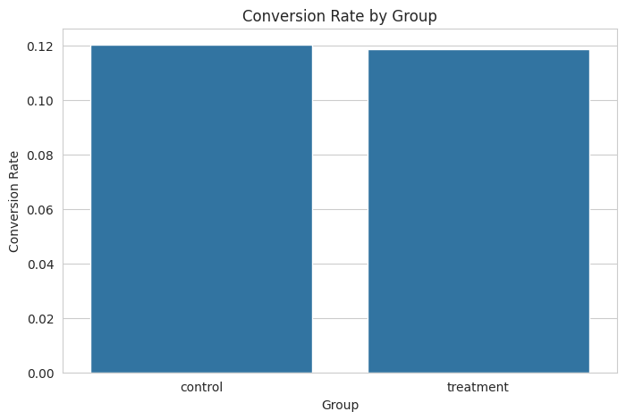
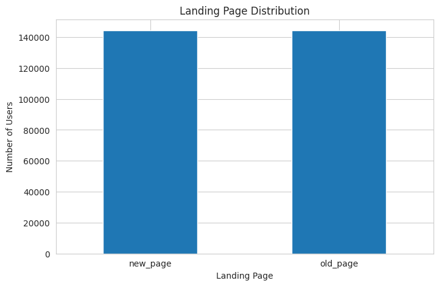
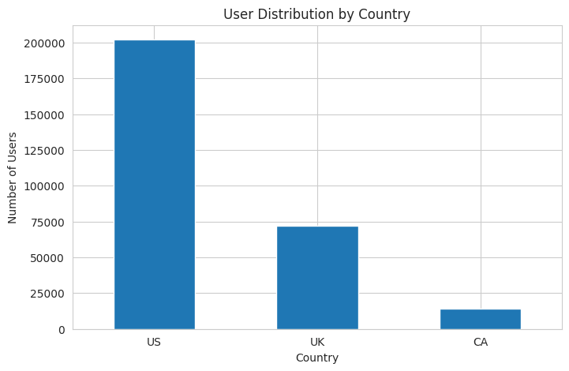

# A/B Testing Analysis: Evaluating New Landing Page Conversion Performance

---

## Project Overview

A/B testing is widely used in digital marketing and product optimization to measure whether a new experience performs better than an existing version.

This project analyzes an A/B testing experiment conducted on an e-commerce landing page.

Users were randomly assigned into two groups:

- **Control Group** → shown the existing landing page
- **Treatment Group** → shown the new landing page

The objective of this analysis was to determine whether the new landing page increased conversion performance and whether the observed difference was statistically significant.

The project combines:

- data cleaning
- exploratory data analysis
- statistical hypothesis testing
- business-focused recommendations

---

## Business Problem

The company launched a redesigned landing page and wanted to measure whether the new version improved user conversion.

The main questions addressed were:

- Does the new landing page generate a higher conversion rate?
- Is the observed difference statistically significant?
- Should the company replace the current landing page?

The final goal was to provide a data-driven recommendation based on the experiment results.

---

## Dataset Description

This project uses two datasets.

### 1. `ab_data.csv`

Main experiment dataset.

Columns:

| Column | Description |
|---|---|
| user_id | Unique user identifier |
| timestamp | Visit time |
| group | Control or treatment |
| landing_page | Old page or new page |
| converted | Conversion result (0 or 1) |

---

### 2. `countries.csv`

User location dataset.

Columns:

| Column | Description |
|---|---|
| user_id | Unique user identifier |
| country | User country |

The datasets were merged using **user_id**.

---

## Tech Stack

### Programming Language

- Python

### Data Analysis

- Pandas
- NumPy

### Data Visualization

- Matplotlib
- Seaborn

### Statistical Testing

- Statsmodels

### Development Environment

- Google Colab

### Version Control

- GitHub

---

## Project Workflow

### 1. Data Loading and Initial Inspection

Loaded both datasets and reviewed:

- first rows
- dimensions
- column structure

Initial dataset size:

| Dataset | Rows | Columns |
|---|---:|---:|
| ab_data | 294,480 | 5 |
| countries | 290,586 | 2 |

---

### 2. Data Cleaning

Performed:

### Missing value check

No missing values were found.

### Duplicate user check

Found duplicate user IDs.

Duplicate users removed:

**3,895**

### Group and landing page validation

Expected structure:

- control → old_page
- treatment → new_page

Invalid rows removed:

**3,893**

Final cleaned dataset:

**288,541 rows**

---

### 3. Exploratory Data Analysis

Explored:

- overall conversion rate
- conversion by experiment group
- landing page distribution
- country distribution

---

## Key Insights

### Overall Conversion Rate

**11.95%**

---

### Conversion Rate by Group

| Group | Conversion Rate |
|---|---:|
| Control | 12.03% |
| Treatment | 11.87% |

Initial observation:

The control group performed slightly better than the treatment group.

---

### Landing Page Distribution

| Landing Page | Users |
|---|---:|
| New Page | 144,315 |
| Old Page | 144,226 |

The distribution was balanced, indicating the experiment assignment was well distributed.

---

### Country Distribution

| Country | Users |
|---|---:|
| US | 202,187 |
| UK | 71,961 |
| CA | 14,394 |

Most users were from the United States.

---

## Statistical Testing

### Why Two-Proportion Z-Test?

A **two-proportion z-test** was selected because:

- there are two independent groups
- the outcome is binary
- sample size is large
- the analysis compares conversion proportions

Why not others:

**T-test**
- used for continuous numerical values

**Chi-square**
- useful for category relationships

The z-test is more direct for A/B testing conversion comparison.

---

## Hypothesis

### Null Hypothesis (H₀)

There is no significant difference in conversion rate between both groups.

### Alternative Hypothesis (H₁)

There is a significant difference in conversion rate.

Significance level:

**α = 0.05**

---

## Test Results

| Metric | Value |
|---|---:|
| Z-statistic | 1.2949 |
| P-value | 0.1953 |
| Alpha | 0.05 |

---

## Interpretation

Because:

**p-value = 0.1953 > 0.05**

The null hypothesis could not be rejected.

This means:

- the observed difference was not statistically significant
- there is not enough evidence that the new landing page performs differently
- the conversion difference may be caused by random variation

---

## Business Recommendation

Based on the analysis:

### Keep the current landing page

The current landing page performed slightly better.

### Do not roll out the new page yet

The improvement was not statistically significant.

### Continue testing

Possible next steps:

- test alternative landing page designs
- analyze user behavior by country
- test additional marketing variations
- segment users further

---

## Project Files

- `ab_testing_landing_page_conversion.ipynb`
- `ab_data.csv`
- `countries.csv`
- `conversion_rate_by_group.png`

---

## Author

**Kenneth Christian Nathanael**  
Data Analyst | Automation Enthusiast

🌐 Portfolio: https://kenchristn.com
